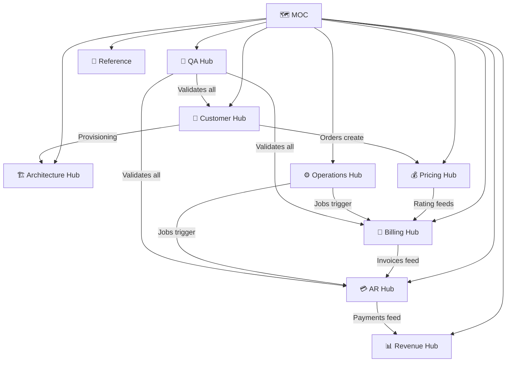

---
aliases:
  - MOC
  - Map of Content
  - KB Index
tags:
  - embrix/moc
  - embrix/index
  - knowledge-base
type: moc
created: 2026-05-07
---

# 🗺️ Embrix O2X Platform — Map of Content (MOC)

> **Purpose**: This is the central Master Index for the entire Embrix O2X Platform Knowledge Base. All knowledge nodes can be accessed from here via WikiLinks.

---

## 🏗️ Hub 1: Architecture

> Overall architecture, microservices, integration patterns, and technology stack.

| Node | Description | Status |
|------|-------------|--------|
| [[01-ARCH-Platform-Overview]] | Embrix O2X Platform overview, value proposition, cloud-native architecture | ✅ |
| [[02-ARCH-Microservices-Stack]] | Spring Boot, GraphQL API, ActiveMQ, PostgreSQL, Multi-Tenant model | ✅ |
| [[03-ARCH-Hub-Module-Structure]] | Hub → Module → Sub-module structure, function mapping | ✅ |
| [[04-ARCH-Gateway-Framework]] | CRM, Provisioning, Payment, Tax, Finance, Document, Support Gateways | ✅ |
| [[05-ARCH-Event-Driven-Architecture]] | ActiveMQ queues, async messaging, event patterns | ✅ |
| [[06-ARCH-Multi-Tenancy]] | Tenant isolation, Flyway migrations, jOOQ, DB schema per tenant | ✅ |
| [[07-ARCH-API-Documentation]] | GraphQL endpoints, REST APIs, Postman collections, environment config | ✅ |
| [[08-ARCH-DevOps-Deployment]] | CI/CD pipeline, GitHub-JIRA integration, release branch process, Vault | ✅ |

---

## 👤 Hub 2: Customer

> Customer management, orders, subscriptions, and provisioning.

| Node | Description | Status |
|------|-------------|--------|
| [[10-CUST-Account-Management]] | Account creation, hierarchy (Parent/Child), B2B/B2C, account types | ✅ |
| [[11-CUST-Contact-Address-Management]] | Contacts, addresses, roles (Billing/Shipping), custom attributes | ✅ |
| [[12-CUST-Order-Management]] | Order types (NEW, MODIFY, CANCEL, SUSPEND, RESUME, RENEW), orchestration | ✅ |
| [[13-CUST-Subscription-Management]] | Subscription lifecycle, service units, price units, multi-subscription | ✅ |
| [[14-CUST-Provisioning]] | Provisioning gateway, Nokia integration, ONT management, work orders | ✅ |
| [[15-CUST-Quote-Management]] | CPQ flow, quote → order conversion, quotation management | ✅ |
| [[16-CUST-Activity-Management]] | Customer activity audit trail, history tracking | ✅ |

---

## 💰 Hub 3: Pricing

> Product catalog, pricing models, bundles/packages, discounts.

| Node | Description | Status |
|------|-------------|--------|
| [[20-PRICE-Item-Master]] | Product family, item configuration, base configurations | ✅ |
| [[21-PRICE-Price-Offer-Models]] | Simple, tiered, volume, staircase, usage-based pricing models | ✅ |
| [[22-PRICE-Discount-Offer-Models]] | Percentage, fixed, tiered, volume, loyalty discount models | ✅ |
| [[23-PRICE-Bundle-Package]] | Bundle (single service-type), Package (multi service-type), dependency | ✅ |
| [[24-PRICE-Usage-Configuration]] | Mediation, stream config, usage processing, CDR handling | ✅ |
| [[25-PRICE-Currency-Resource]] | Currency config, rounding, exchange rates, multi-currency support | ✅ |

---

## 📄 Hub 4: Billing

> Billing cycles, rating, usage processing, taxation, invoicing.

| Node | Description | Status |
|------|-------------|--------|
| [[30-BILL-Billing-Cycle]] | Billing configuration, BillCheck/InvoiceCheck jobs, cycle management | ✅ |
| [[31-BILL-Rating-Engine]] | One-time, recurring, usage rating, proration logic | ✅ |
| [[32-BILL-Usage-Processing]] | Mediation, CDR processing, suspended/failed batches, reprocessing | ✅ |
| [[33-BILL-Tax-Configuration]] | Tax gateway, tax codes, tax rates, tax exemptions, VAT/IVA | ✅ |
| [[34-BILL-Invoice-Management]] | Invoice generation, invoice lines, tax lines, stamping, manual invoices | ✅ |
| [[35-BILL-Proration-Rules]] | Long/short cycle, partial suspend/cancel proration, grace period billing | ✅ |

---

## 💳 Hub 5: AR — Accounts Receivable

> AR operations, payments, collections, disputes.

| Node | Description | Status |
|------|-------------|--------|
| [[40-AR-Operations]] | Credit notes, debit notes, adjustments, write-offs, multi-level approval | ✅ |
| [[41-AR-Payment-Management]] | Payment processing, payment history, payment reversal, refunds | ✅ |
| [[42-AR-Collections]] | Collection configuration, collection agents, suspension/reconnection flow | ✅ |
| [[43-AR-Disputes]] | Dispute creation, resolution, threshold management | ✅ |
| [[44-AR-Payment-Arrangement]] | Installment plans, fixed terms, invoice selection, compensation months | ✅ |
| [[45-AR-Grace-Period-Extension]] | Invoice due date extension, grace period management | ✅ |

---

## 📊 Hub 6: Revenue

> Revenue recognition, GL configuration, accounting, journals.

| Node | Description | Status |
|------|-------------|--------|
| [[50-REV-Multi-Org-Setup]] | Selling company, legal entity, business unit configuration | ✅ |
| [[51-REV-GL-Configuration]] | General Ledger segments, account ranges, chart of accounts | ✅ |
| [[52-REV-Accounting-Policies]] | Accounting conventions, revenue recognition methods, split rules | ✅ |
| [[53-REV-Accounting-Calendar]] | Finance periods, calendar setup, period closure | ✅ |
| [[54-REV-Revenue-Journals]] | Revenue batches, receipt journals, revenue reports, downloads | ✅ |
| [[55-REV-4Cs-Framework]] | Chart of Accounts, Calendar, Currency, Convention | ✅ |

---

## ⚙️ Hub 7: Operations

> User management, jobs, correspondence, reports, instance management.

| Node | Description | Status |
|------|-------------|--------|
| [[60-OPS-User-Management]] | Roles, permissions, role groups, user CRUD | ✅ |
| [[61-OPS-Jobs-Management]] | Job scheduling, BillCheck, InvoiceCheck, CollectionCreate, CollectionActions | ✅ |
| [[62-OPS-Correspondence]] | Email templates, notification configuration, correspondence delivery | ✅ |
| [[63-OPS-Reports-Dashboards]] | Accounts reports, dashboards, data export (Excel/PDF) | ✅ |
| [[64-OPS-Instance-Management]] | Tenant config, instance data, master data, support config | ✅ |
| [[65-OPS-Task-Administration]] | Task creation, ticket management, Zendesk integration | ✅ |
| [[66-OPS-Work-Management]] | Work calendar, work order management | ✅ |
| [[67-OPS-Policy-Enablers]] | Customer/Billing/AR/Revenue/Ops Hub policy properties | ✅ |

---

## 🧪 Hub 8: QA & Testing

> Test cases, regression suite, QA notes, troubleshooting.

| Node | Description | Status |
|------|-------------|--------|
| [[70-QA-Regression-Suite-Overview]] | S001–S008 scenario matrix, TC-01 to TC-51 mapping | ✅ |
| [[71-QA-E2E-Residential-Flow]] | S001 residential lifecycle: create → provision → bill → collect → suspend → reconnect | ✅ |
| [[72-QA-Plan-Change-Flow]] | S002 plan change: modify order, verify invoice reflection | ✅ |
| [[73-QA-Grace-Period-PayArrangement]] | S003 grace period, extension, payment arrangement, installments | ✅ |
| [[74-QA-CreditDebit-Disputes]] | S004 credit notes, debit notes, disputes, relocation orders | ✅ |
| [[75-QA-Service-Termination]] | S005 service termination, equipment retrieval, Coopeweb notification | ✅ |
| [[76-QA-Intercompany-Account]] | S006 intercompany flow, auto credit note, work order | ✅ |
| [[77-QA-Tax-Exemption]] | S007 business account tax exemptions, manual invoice validation | ✅ |
| [[78-QA-PHC-Account]] | S008 PHC 36-month billing, device contract expiration | ✅ |
| [[79-QA-UI-Module-TestCases]] | TC-18 to TC-51: UI regression for all modules (Customer, Billing, AR, Pricing, Revenue, Ops) | ✅ |
| [[80-QA-Notes-Troubleshooting]] | Common bugs, proration issues, rounding errors, ActiveMQ monitoring, log interpretation | ✅ |

---

## 🔗 Cross-Reference: Error Codes & Glossary

| Node | Description | Status |
|------|-------------|--------|
| [[90-REF-Error-Codes]] | API error codes by Hub: Customer, Billing, AR, Revenue, Operations | ✅ |
| [[91-REF-Glossary]] | Official Embrix glossary: O2C, SOR, SOT, Hub definitions, Gateway types | ✅ |
| [[92-REF-API-Endpoints]] | API endpoint reference: Account, Billing, Payment, Provisioning | ✅ |

---

## 📐 Knowledge Graph — Key Links

---

## 📁 Source Document Mapping

> Mapping from source documents (172 files) to KB nodes.

| Source Category | Files | Target Hubs |
|----------------|-------|-------------|
| Architecture docs (000.x, Embrix Architecture) | 8 files | Architecture |
| User Guides (1-5) | 5 files | All Hubs |
| Configuration slides (002-016) | 45 files | Customer, Pricing, Billing, AR, Revenue, Ops |
| Training videos (transcribed) | 50+ files | All Hubs |
| Demo slides (Dish, MCM, Boingo, etc.) | 15 files | Customer, Pricing |
| QA documents (Master_TestCases, Regression, QA_Notes) | 4 files | QA |
| Error Codes & Policy Enablers | 2 files | Reference |
| MCM Integration docs | 6 files | Architecture, Customer |
| DevOps docs (Mani, VaultUpdate) | 5 files | Architecture |
| Business flows | 2 files | Billing, AR |
| BRM training videos | 15 files | Architecture (legacy context) |

---

*Last updated: 2026-05-07 | Generated from 172 source documents*
