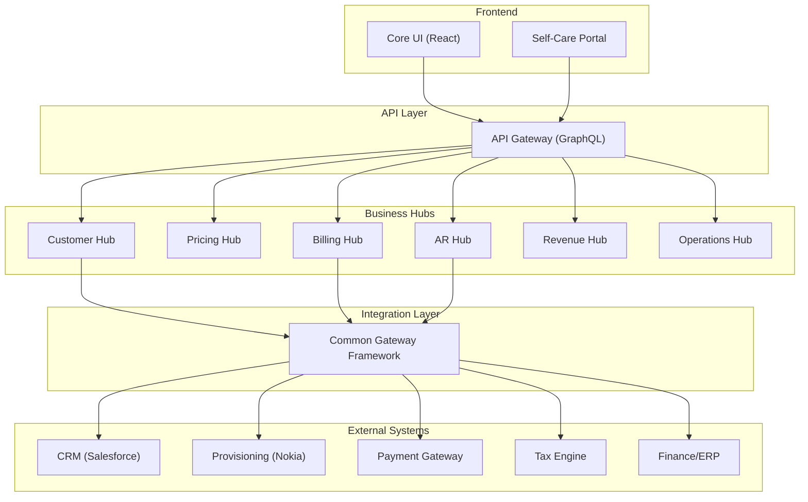

---
aliases:
  - Platform Overview
  - Embrix Architecture
  - O2X Platform
tags:
  - embrix/architecture
  - embrix/overview
  - embrix/o2x
type: knowledge
hub: Architecture
created: 2026-05-07
sources:
  - "000.a Embrix Architecture and Value Proposition_pptx.md"
  - "000.c Embrix Solution Architecture_pptx.md"
  - "BRM Intro - video 1 (transcribed).md"
---

# 🏗️ Embrix O2X Platform Overview

> **Parent**: [[00-MOC-Embrix-Knowledge-Base]]
> **Hub**: Architecture
> **Related**: [[02-ARCH-Microservices-Stack]] | [[03-ARCH-Hub-Module-Structure]] | [[04-ARCH-Gateway-Framework]]

---

## 1. What is Embrix O2X?

**Embrix O2X** is a **cloud-native Order-to-Cash (O2C) platform** designed for telecommunications and multi-service operators. It manages the entire lifecycle from customer order to revenue recognition.

### Key Capabilities:
- 🔄 **Order-to-Cash**: Complete end-to-end flow from order creation to revenue recognition
- 🏢 **Multi-Tenant**: Single platform supports multiple operators (tenants)
- ☁️ **Cloud-Native**: Microservices architecture, containerized, horizontally scalable
- 🌍 **Multi-Market**: Supports LATAM, North America, and Asia-Pacific requirements
- 🔌 **API-First**: GraphQL + REST APIs for full integration

---

## 2. Platform Architecture

---

## 3. Core Value Propositions

| Value | Description |
|-------|-------------|
| **Rapid Deployment** | Pre-built telecom business logic, ~6 months to production |
| **Configurability** | Policy enablers instead of custom code |
| **Scalability** | Microservices + multi-tenant = horizontal scaling |
| **Integration Ready** | Common Gateway Framework for plug-and-play integration |
| **LATAM Ready** | Native support for IVA, CFDI, PAC/SAT tax stamping |

---

## 4. Hub Overview

| Hub | Purpose | SOT For |
|-----|---------|---------|
| **Customer** | Account, order, subscription, provisioning management | Customer data, orders, subscriptions |
| **Pricing** | Product catalog, pricing models, bundles, discounts | Product catalog, pricing rules |
| **Billing** | Rating, invoicing, tax calculation, usage processing | Invoices, billing events |
| **AR** | Payments, collections, adjustments, disputes | AR balance, payment records |
| **Revenue** | GL configuration, revenue recognition, journals | Revenue records, GL entries |
| **Operations** | Users, jobs, correspondence, reports, policies | System configuration |

---

## 5. Target Market

| Segment | Examples |
|---------|----------|
| **Telecom Operators** | Coopeguanacaste (Costa Rica), Dish (Mexico) |
| **ISPs** | Fiber, cable, broadband providers |
| **Multi-Service** | Internet + TV + Voice bundles |
| **B2B Enterprises** | Managed services, wholesale |

---

*Back to [[00-MOC-Embrix-Knowledge-Base]]*
