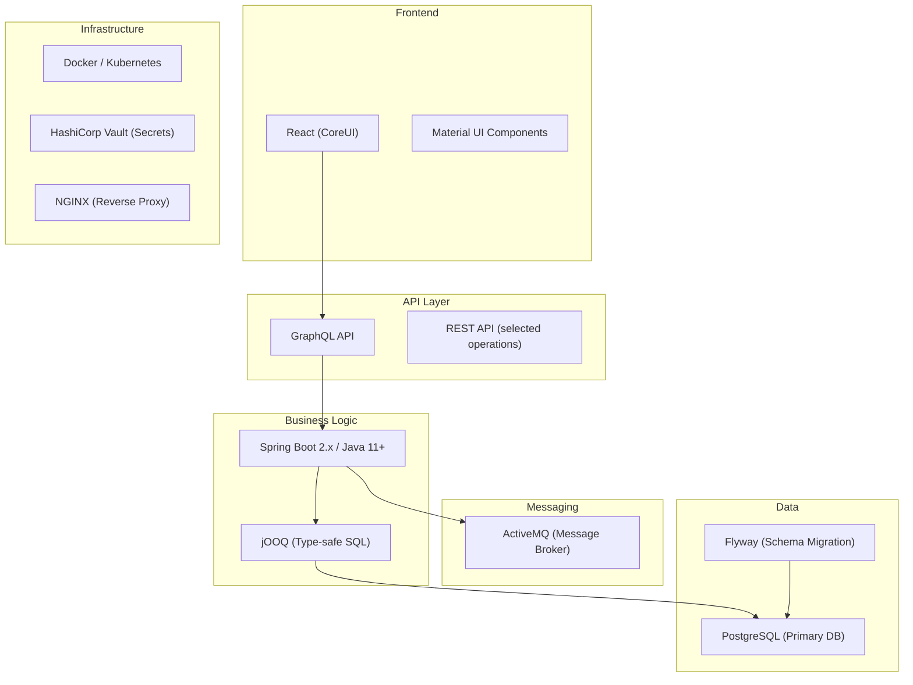

---
aliases:
  - Microservices Stack
  - Technology Stack
  - Backend Architecture
tags:
  - embrix/architecture
  - embrix/microservices
  - embrix/tech-stack
type: knowledge
hub: Architecture
created: 2026-05-07
sources:
  - "000.a Embrix Architecture and Value Proposition_pptx.md"
  - "000.b Embrix Solution Architecture - Technical_pptx.md"
  - "BRM Intro - video 1 (transcribed).md"
  - "BRM Technical Training - video 2 (transcribed).md"
---

# 🏗️ Microservices Stack

> **Parent**: [[00-MOC-Embrix-Knowledge-Base]]
> **Hub**: Architecture
> **Related**: [[01-ARCH-Platform-Overview]] | [[05-ARCH-Event-Driven-Architecture]] | [[06-ARCH-Multi-Tenancy]]

---

## 1. Technology Stack



---

## 2. Backend Services

| Service | Purpose | Port (local) |
|---------|---------|-------------|
| **Customer Service** | Account, order, subscription management | 8081 |
| **Pricing Service** | Product catalog, pricing models, bundles | 8082 |
| **Billing Service** | Rating, invoicing, usage processing | 8083 |
| **AR Service** | Payments, collections, adjustments | 8084 |
| **Revenue Service** | GL, revenue recognition, journals | 8085 |
| **Operations Service** | Users, jobs, correspondence, config | 8086 |
| **Gateway Service** | External integration (CRM, provisioning, payment) | 8087 |
| **Auth Service** | Authentication, authorization, SSO | 8088 |

---

## 3. Data Architecture

### Database Strategy:
| Aspect | Implementation |
|--------|---------------|
| **DB Engine** | PostgreSQL 13+ |
| **Multi-Tenant** | Schema-per-tenant isolation |
| **Schema Naming** | `{tenant_id}_schema` |
| **Migrations** | Flyway — versioned SQL scripts |
| **Query Builder** | jOOQ — type-safe SQL generation |
| **Connection Pool** | HikariCP |

### Data Mapping:
```
Tenant: coopeguanacaste
├── Schema: coopeg_schema
│   ├── Tables: account, contact, address, order...
│   └── Sequences: account_seq, order_seq...
├── Schema: coopeg_billing
│   ├── Tables: invoice, bill_item, tax_line...
│   └── Sequences: invoice_seq...
└── Schema: coopeg_revenue
    ├── Tables: gl_entry, journal, period...
    └── Sequences: journal_seq...
```

---

## 4. API Layer

### GraphQL:
- **Primary API**: All CRUD operations use GraphQL mutations/queries
- **Endpoint**: `{base_url}/graphql`
- **Schema**: Auto-generated from Spring Boot annotations
- **Tools**: GraphiQL explorer available in dev environments

### REST (Limited):
- File upload/download operations
- Health check endpoints
- Legacy integration endpoints

---

## 5. Key Technical Decisions

| Decision | Choice | Rationale |
|----------|--------|-----------|
| **API Protocol** | GraphQL | Flexible query, reduce over-fetching |
| **ORM** | jOOQ (not Hibernate) | Type-safe SQL, full control over queries |
| **Messaging** | ActiveMQ | Reliable async processing, DLQ support |
| **DB** | PostgreSQL | JSON support, extensibility, multi-schema |
| **Migration** | Flyway | Versioned migrations, repeatable scripts |
| **Secrets** | Vault | Centralized secrets management |

---

*Back to [[00-MOC-Embrix-Knowledge-Base]]*
