---
aliases:
  - Hub Module Structure
  - Functional Hierarchy
tags:
  - embrix/architecture
  - embrix/structure
type: knowledge
hub: Architecture
created: 2026-05-07
sources:
  - "000.c Embrix Solution Architecture_pptx.md"
  - "2 - Embrix User Guide - Admin_pdf.md"
---

# 🏗️ Hub → Module → Sub-module Structure

> **Parent**: [[00-MOC-Embrix-Knowledge-Base]]
> **Hub**: Architecture
> **Related**: [[01-ARCH-Platform-Overview]] | [[67-OPS-Policy-Enablers]]

---

## 1. Functional Hierarchy

```mermaid
graph TB
    P["Embrix O2X Platform"]
    
    CH["👤 Customer Hub"]
    PH["💰 Pricing Hub"]
    BH["📄 Billing Hub"]
    AH["💳 AR Hub"]
    RH["📊 Revenue Hub"]
    OH["⚙️ Operations Hub"]
    
    P --> CH
    P --> PH
    P --> BH
    P --> AH
    P --> RH
    P --> OH
    
    CH --> CM["Account Management"]
    CH --> OM["Order Management"]
    CH --> SM["Subscription Management"]
    CH --> PM_C["Provisioning Management"]
    
    PH --> IM["Item Master"]
    PH --> PR["Price Management"]
    PH --> BM["Bundle/Package Management"]
    
    BH --> BC["Billing Cycle"]
    BH --> RE["Rating Engine"]
    BH --> TX["Tax Configuration"]
    
    AH --> AO["AR Operations"]
    AH --> PY["Payment Management"]
    AH --> CO["Collections"]
    
    RH --> GL["GL Configuration"]
    RH --> RR["Revenue Recognition"]
    
    OH --> UM["User Management"]
    OH --> JM["Jobs Management"]
    OH --> CP["Correspondence"]
```



---

## 2. Hub → Module Mapping

| Hub | Modules | Key Sub-modules |
|-----|---------|----------------|
| **Customer** | Account Mgmt, Order Mgmt, Subscription Mgmt, Provisioning, Quote Mgmt, Activity Mgmt | Contacts, Addresses, Work Orders |
| **Pricing** | Item Master, Price Offers, Discount Offers, Bundle/Package Mgmt, Usage Config, Currency | Product Family, Dependencies |
| **Billing** | Billing Cycle, Rating Engine, Usage Processing, Tax Config, Invoice Mgmt, Proration | Bill Items, Tax Lines |
| **AR** | AR Operations, Payment Mgmt, Collections, Disputes, Payment Arrangement, Grace Period | Credit/Debit Notes, Write-offs |
| **Revenue** | Multi-Org, GL Config, Accounting Policies, Accounting Calendar, Revenue Journals, 4Cs | COA, Selling Company |
| **Operations** | User Mgmt, Jobs Mgmt, Correspondence, Reports, Instance Mgmt, Tasks, Work Mgmt, Policies | Roles, Templates, Dashboards |

---

## 3. Navigation Pattern

### UI Navigation Structure:
```
Home → Select Hub → Select Module → Select Sub-module → Actions (CRUD)
```

### Hub Entry Points:
| Hub | UI Path |
|-----|---------|
| Customer | Customer Center → Account + Order / Order Management / Quotation |
| Pricing | Pricing Center → Basic Config / Price Management / Bundle Management |
| Billing | Billing Center → Billing / Taxes / Usage |
| AR | AR Center → Payments / AR Operations / Collections |
| Revenue | Revenue Center → Configuration / Revenues |
| Operations | Operations Center → User Mgmt / Job Mgmt / Correspondence / Reports |

---

## 4. Data Ownership (SOT vs SOR)

| Data Domain | SOT (Embrix) | SOR (External) |
|-------------|-------------|----------------|
| Customer accounts | ✅ | — |
| Orders & subscriptions | ✅ | — |
| Product catalog | ✅ | — |
| Invoices & billing | ✅ | — |
| AR balance | ✅ | — |
| Customer master data | — | ✅ CRM |
| Equipment inventory | — | ✅ Nokia |
| Tax rates | — | ✅ Tax Engine |
| Financial postings | — | ✅ ERP |

---

*Back to [[00-MOC-Embrix-Knowledge-Base]]*
