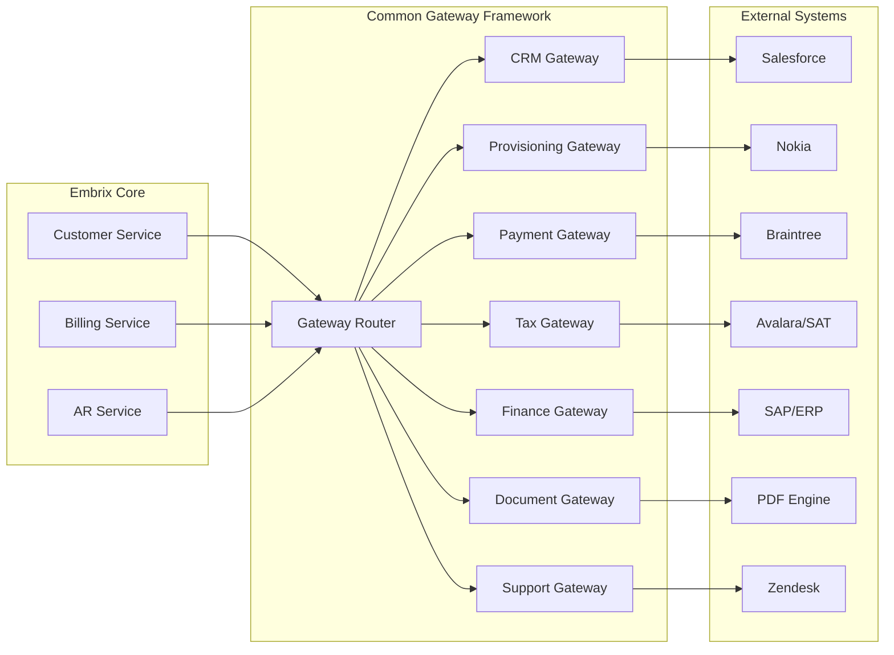
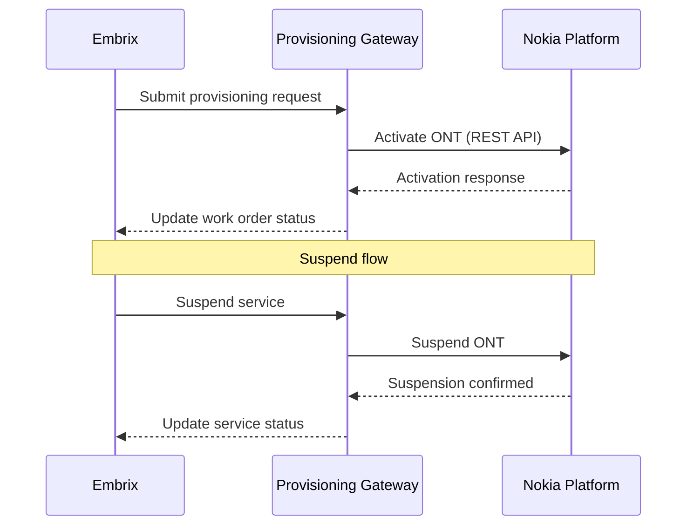

---
aliases:
  - Gateway Framework
  - Common Gateway Framework
  - CGF
tags:
  - embrix/architecture
  - embrix/gateway
  - embrix/integration
type: knowledge
hub: Architecture
created: 2026-05-07
sources:
  - "000.c Embrix Solution Architecture_pptx.md"
  - "BRM Gateway - video 3 (transcribed).md"
  - "BRM Gateway - video 4 (transcribed).md"
---

# 🏗️ Common Gateway Framework (CGF)

> **Parent**: [[00-MOC-Embrix-Knowledge-Base]]
> **Hub**: Architecture
> **Related**: [[01-ARCH-Platform-Overview]] | [[05-ARCH-Event-Driven-Architecture]] | [[14-CUST-Provisioning]]

---

## 1. Gateway Architecture



---

## 2. Gateway Types

| Gateway | Direction | Purpose | External System |
|---------|-----------|---------|----------------|
| **CRM Gateway** | Bidirectional | Customer data sync, lead management | Salesforce, HubSpot |
| **Provisioning Gateway** | Bidirectional | Service activation, ONT management | Nokia, Calix |
| **Payment Gateway** | Outbound → Inbound | Payment processing, tokenization | Braintree, Stripe, BCR |
| **Tax Gateway** | Outbound → Inbound | Tax calculation, stamping | Avalara, SAT (Mexico) |
| **Finance Gateway** | Outbound | GL posting, journal export | SAP, Oracle ERP |
| **Document Gateway** | Outbound | Invoice PDF generation, correspondence | Internal PDF engine |
| **Support Gateway** | Bidirectional | Ticket sync, task management | Zendesk, ServiceNow |

---

## 3. Gateway Implementation Pattern

### Standard Gateway Flow:
```
1. Business Event triggers gateway call
2. Gateway Router selects appropriate adapter
3. Adapter transforms Embrix data → External format
4. HTTP/SOAP/MQ call to external system
5. Response transformed → Embrix format
6. Result stored / status updated
```

### Error Handling:
| Scenario | Behavior |
|----------|----------|
| External system timeout | Retry with exponential backoff |
| External system error | Log error, update status, alert |
| Data transformation failure | Reject with error code |
| Network unreachable | Queue message for later retry (DLQ) |

---

## 4. Configuration

### Gateway Configuration Path:
```
Operations Center → Instance Management → Gateway Config →
  Select Gateway Type → Configure endpoint URL, credentials, timeout →
  Test connection → SAVE
```

### Key Configuration Parameters:
| Parameter | Description | Example |
|-----------|-------------|---------|
| `endpoint.url` | External system URL | `https://api.nokia.com/provision` |
| `timeout.ms` | Request timeout | 30000 |
| `retry.count` | Number of retries | 3 |
| `retry.delay.ms` | Delay between retries | 5000 |
| `auth.type` | Authentication type | Bearer, API-Key, OAuth2 |

---

## 5. Provisioning Gateway Details

### Nokia Integration Flow:


---

*Back to [[00-MOC-Embrix-Knowledge-Base]]*
