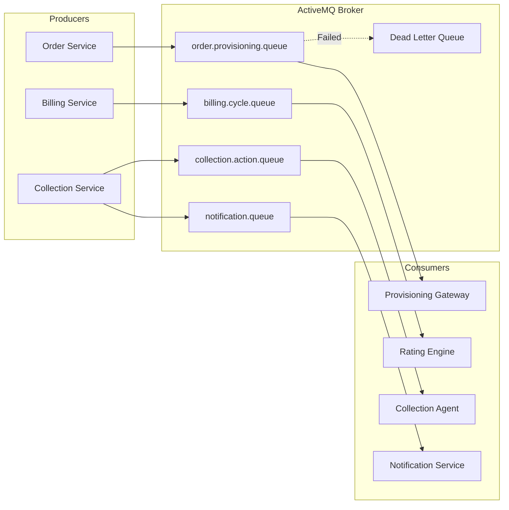

---
aliases:
  - Event-Driven Architecture
  - ActiveMQ
  - Async Messaging
tags:
  - embrix/architecture
  - embrix/messaging
  - embrix/activemq
type: knowledge
hub: Architecture
created: 2026-05-07
sources:
  - "000.b Embrix Solution Architecture - Technical_pptx.md"
  - "BRM Technical Training - video 2 (transcribed).md"
---

# 🏗️ Event-Driven Architecture

> **Parent**: [[00-MOC-Embrix-Knowledge-Base]]
> **Hub**: Architecture
> **Related**: [[02-ARCH-Microservices-Stack]] | [[04-ARCH-Gateway-Framework]] | [[61-OPS-Jobs-Management]]

---

## 1. Messaging Architecture

Embrix uses **ActiveMQ** as its message broker for asynchronous inter-service communication.

---

## 2. Key Queues

| Queue Name | Producer | Consumer | Purpose |
|------------|----------|----------|---------|
| `order.provisioning` | Order Service | Provisioning Gateway | Service activation/deactivation |
| `provisioning.response` | Provisioning Gateway | Order Service | Provisioning result callback |
| `billing.cycle` | Job Service | Billing Service | Billing cycle triggers |
| `collection.action` | Collection Service | Collection Agent | Collection action execution |
| `notification` | Various | Notification Service | Email/SMS delivery |
| `payment.process` | Payment Service | Payment Gateway | Payment processing |
| `revenue.recognition` | Revenue Service | GL Service | Revenue journal posting |

---

## 3. Message Flow Patterns

### Fire-and-Forget:
- Producer sends message and continues
- Used for: notifications, logging, audit trail

### Request-Reply:
- Producer sends request, waits for response on reply queue
- Used for: provisioning, payment processing

### Event Sourcing:
- Events published as they occur
- Multiple consumers can process same event
- Used for: billing events, status changes

---

## 4. Dead Letter Queue (DLQ)

| Aspect | Detail |
|--------|--------|
| **Purpose** | Store messages that fail processing after max retries |
| **Max Retries** | Configurable (default: 3) |
| **Monitoring** | ActiveMQ web console → Queues → DLQ |
| **Resolution** | Manual investigation → fix → replay from DLQ |

> ⚠️ **QA Note**: Always check DLQ after provisioning tests. Stuck messages indicate integration issues.

---

*Back to [[00-MOC-Embrix-Knowledge-Base]]*
