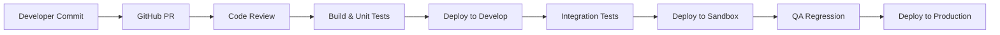

---
aliases:
  - DevOps
  - Deployment
  - CI/CD
tags:
  - embrix/architecture
  - embrix/devops
  - embrix/deployment
type: knowledge
hub: Architecture
created: 2026-05-07
sources:
  - "Mani - Embrix DevOps (transcribed).md"
  - "VaultUpdate (transcribed).md"
---

# 🏗️ DevOps & Deployment

> **Parent**: [[00-MOC-Embrix-Knowledge-Base]]
> **Hub**: Architecture
> **Related**: [[02-ARCH-Microservices-Stack]] | [[06-ARCH-Multi-Tenancy]]

---

## 1. CI/CD Pipeline

## 2. Branch Strategy

| Branch | Purpose | Deploys To |
|--------|---------|-----------|
| `feature/*` | Feature development | — |
| `develop` | Integration branch | Develop environment |
| `release/*` | Release candidate | Sandbox environment |
| `main` | Production code | Production environment |
| `hotfix/*` | Emergency fixes | Direct to production |

## 3. Environment Matrix

| Environment | URL Pattern | Purpose | Date Control |
|-------------|-------------|---------|-------------|
| **Develop** | `*.dev.embrix.org` | Development, unit testing | GraphQL mutation |
| **Sandbox** | `*.sandbox.embrix.org` | QA regression, UAT | GraphQL mutation |
| **Production** | `*.{tenant}.embrix.org` | Live production | System clock |

## 4. Secrets Management

| Tool | Purpose |
|------|---------|
| **HashiCorp Vault** | Centralized secrets store |
| **Secrets Types** | DB credentials, API keys, SSL certificates |
| **Access** | Service accounts via Vault agent |
| **Rotation** | Automated secret rotation policies |

## 5. Deployment Checklist

1. ✅ All tests passing on `release` branch
2. ✅ Flyway migrations reviewed and tested
3. ✅ API compatibility verified (no breaking changes)
4. ✅ Vault secrets updated for target environment
5. ✅ Rollback plan documented
6. ✅ Monitoring dashboards configured

---

*Back to [[00-MOC-Embrix-Knowledge-Base]]*
