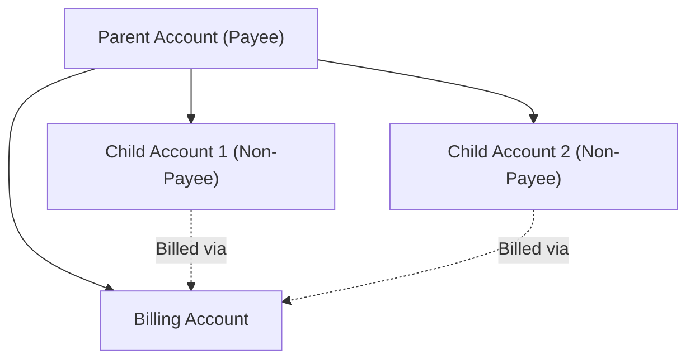
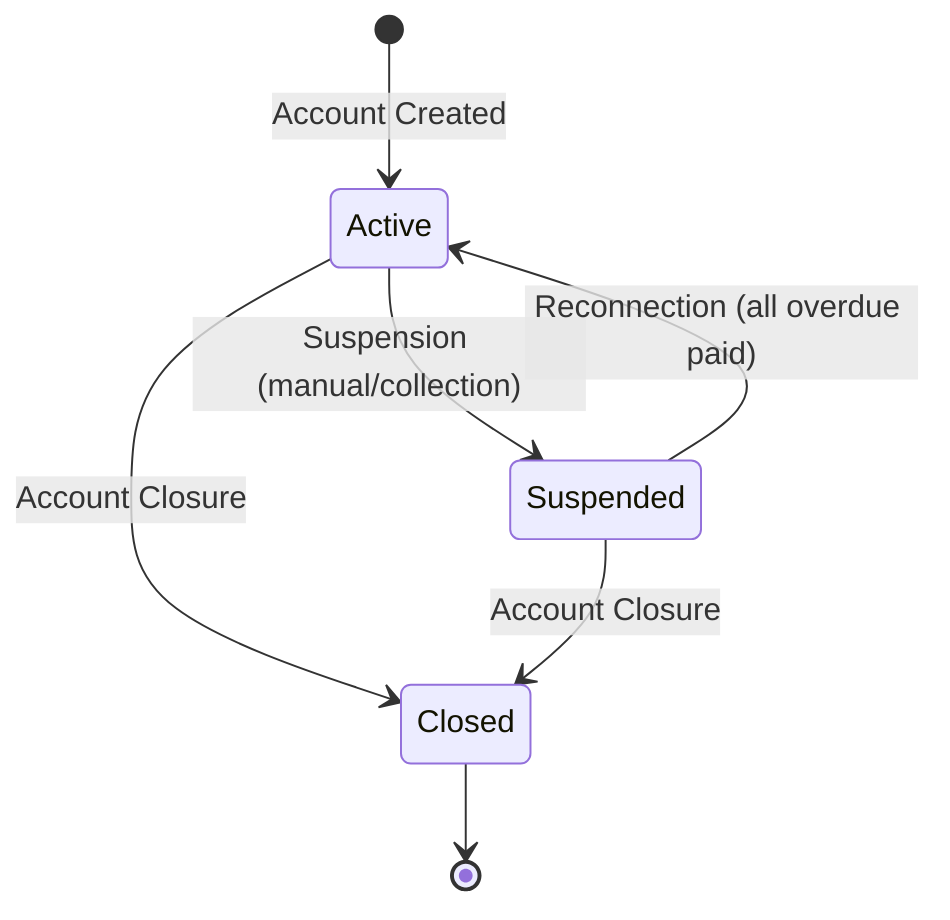

---
aliases:
  - Account Management
  - Account Hierarchy
  - B2B B2C
tags:
  - embrix/customer
  - embrix/account
type: knowledge
hub: Customer
created: 2026-05-07
sources:
  - "003.a Account Management_pptx.md"
  - "003.b Account Configuration_pptx.md"
  - "3 - Embrix User Guide - Customer Hub_pdf.md"
  - "BRM Cinguration - video 5 (transcribed).md"
---

# 👤 Account Management

> **Parent**: [[00-MOC-Embrix-Knowledge-Base]]
> **Hub**: Customer
> **Related**: [[11-CUST-Contact-Address-Management]] | [[12-CUST-Order-Management]] | [[67-OPS-Policy-Enablers]]

---

## 1. Account Types

| Type | Description | Use Case |
|------|-------------|----------|
| **Direct Customer** | End-user account | B2C residential |
| **Client** | B2B enterprise account | Business services |
| **Party** | Related entity (not direct customer) | Partners, affiliates |
| **Partner** | Reseller or channel partner | Indirect sales |
| **Reseller** | Authorized reseller account | Distribution |

## 2. Account Hierarchy



### Hierarchy Rules:
| Rule | Detail |
|------|--------|
| Parent = Payee | Parent account is responsible for payment |
| Child = Non-Payee | Child accounts inherit billing from parent |
| Billing Profile Match | Child must match parent billing profile |
| Product Family Match | Child must match parent product family |
| BDOM Inheritance | Child inherits BDOM from parent |

## 3. Account Creation

### Via API (Payload):
```
POST /graphql
Mutation: createAccount
Required: name, accountType, customerSegment, billingProfile, contacts[], addresses[]
```

### Via UI:
```
Customer Center → Account + Order → CREATE →
  General Info → Contacts → Addresses → Billing Profile →
  Select Package → SUBMIT
```

## 4. Customer Segments

| Segment | Description |
|---------|-------------|
| **B2C** | Business-to-Consumer (residential) |
| **B2B** | Business-to-Business (enterprise) |
| **B2B2C** | Business-to-Business-to-Consumer (wholesale) |

## 5. Account Lifecycle



## 6. Key Configuration

| Parameter | Description | Default |
|-----------|-------------|---------|
| **BDOM** | Billing Day of Month (1-28) | 1 |
| **Payment Term** | Invoice due date offset | NET-15 |
| **Currency** | Account default currency | CRC |
| **Selling Company** | Business unit code | 0900 |
| **Initial Term** | Contract initial period | 2 YEARS |
| **Renewal Term** | Auto-renewal period | 12 MONTHS |

---

*Back to [[00-MOC-Embrix-Knowledge-Base]]*
