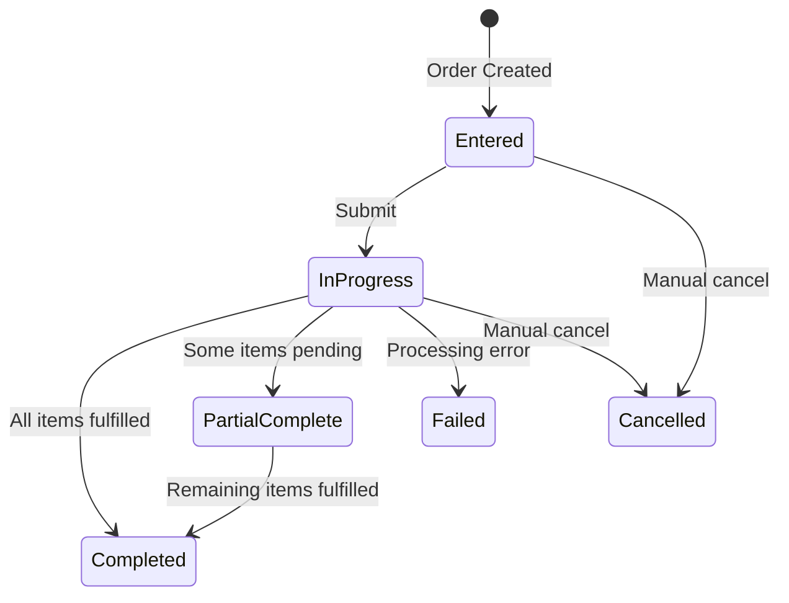
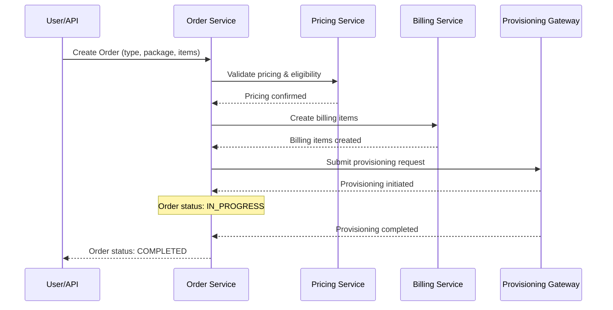

---
aliases:
  - Order Management
  - Order Lifecycle
  - Order Types
tags:
  - embrix/customer
  - embrix/order
type: knowledge
hub: Customer
created: 2026-05-07
sources:
  - "004 Order Management_pptx.md"
  - "3 - Embrix User Guide - Customer Hub_pdf.md"
  - "BRM Order Management - video 6 (transcribed).md"
---

# 👤 Order Management

> **Parent**: [[00-MOC-Embrix-Knowledge-Base]]
> **Hub**: Customer
> **Related**: [[10-CUST-Account-Management]] | [[13-CUST-Subscription-Management]] | [[14-CUST-Provisioning]]

---

## 1. Order Types

| Type | Code | Purpose |
|------|------|---------|
| **New** | `NEW` | Initial service order for a new account |
| **Modify** | `MODIFY` | Change plan/package on existing subscription |
| **Cancel** | `CANCEL` | Terminate service |
| **Suspend** | `SUSPEND` | Temporarily suspend service |
| **Resume** | `RESUME` | Restore suspended service |
| **Renew** | `RENEW` | Renew expired contract |
| **Relocate** | `RELOCATE` | Move service to new address |

## 2. Order Lifecycle



## 3. Order Processing Flow



## 4. Order Items

| Component | Description |
|-----------|-------------|
| **Service Unit** | The service being ordered (e.g., Internet 100Mbps) |
| **Price Unit** | The pricing applied to the service |
| **Equipment** | Hardware/device (e.g., ONT, router) |
| **Contract Terms** | Initial term, renewal term, early termination fee |

## 5. Order Creation (UI)

```
Customer Center → Account + Order → Create New Order →
  Select Account →
  Order Type: [NEW | MODIFY | CANCEL | SUSPEND | RESUME] →
  Select Package/Items →
  Review → SUBMIT
```

## 6. Key Rules

| Rule | Description |
|------|-------------|
| One active NEW order per account | Cannot create second NEW before first completes |
| MODIFY requires active subscription | Can only modify existing active services |
| CANCEL generates prorated credit | Final cycle is prorated from cancel date |
| SUSPEND stops billing | No charges during suspension (configurable) |
| RESUME restarts billing | Billing resumes from resume date |

---

*Back to [[00-MOC-Embrix-Knowledge-Base]]*
