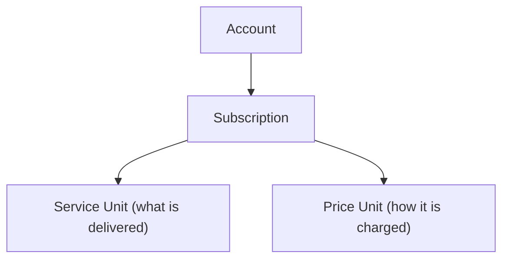
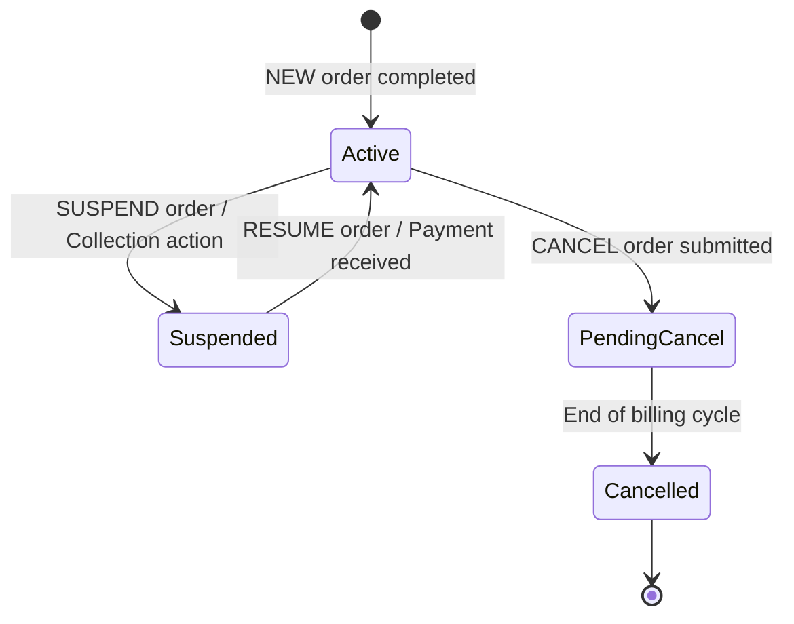

---
aliases:
  - Subscription Management
  - Service Lifecycle
tags:
  - embrix/customer
  - embrix/subscription
type: knowledge
hub: Customer
created: 2026-05-07
sources:
  - "005 Subscription Management_pptx.md"
  - "3 - Embrix User Guide - Customer Hub_pdf.md"
---

# 👤 Subscription Management

> **Parent**: [[00-MOC-Embrix-Knowledge-Base]]
> **Hub**: Customer
> **Related**: [[12-CUST-Order-Management]] | [[30-BILL-Billing-Cycle]] | [[23-PRICE-Bundle-Package]]

---

## 1. Subscription Structure

| Component | Description |
|-----------|-------------|
| **Subscription** | The container linking service and pricing |
| **Service Unit** | What service is delivered (e.g., Internet 100Mbps) |
| **Price Unit** | How the service is charged (recurring, one-time, usage) |

## 2. Subscription Lifecycle

## 3. Contract Terms

| Parameter | Description | Example |
|-----------|-------------|---------|
| **Initial Term** | Minimum contract duration | 24 months |
| **Renewal Term** | Auto-renewal period | 12 months |
| **Early Termination Fee** | Penalty for early cancellation | $50 |
| **Start Date** | Service activation date | Order completion date |
| **End Date** | Contract end date | Start + Initial Term |

## 4. Multi-Subscription Support

An account can have multiple subscriptions simultaneously:
- Internet service (Subscription 1)
- TV service (Subscription 2)
- Voice service (Subscription 3)

Each subscription is independently managed (suspend, modify, cancel).

## 5. Key Operations

| Operation | Trigger | Effect |
|-----------|---------|--------|
| **Create** | NEW order | Subscription + service + pricing created |
| **Modify** | MODIFY order | Plan/price change on next cycle |
| **Suspend** | SUSPEND order or collection | Service paused, billing paused |
| **Resume** | RESUME order or payment | Service restored, billing restarts |
| **Cancel** | CANCEL order | Service terminated at cycle end |
| **Renew** | Auto or manual | Contract extended by renewal term |

---

*Back to [[00-MOC-Embrix-Knowledge-Base]]*
