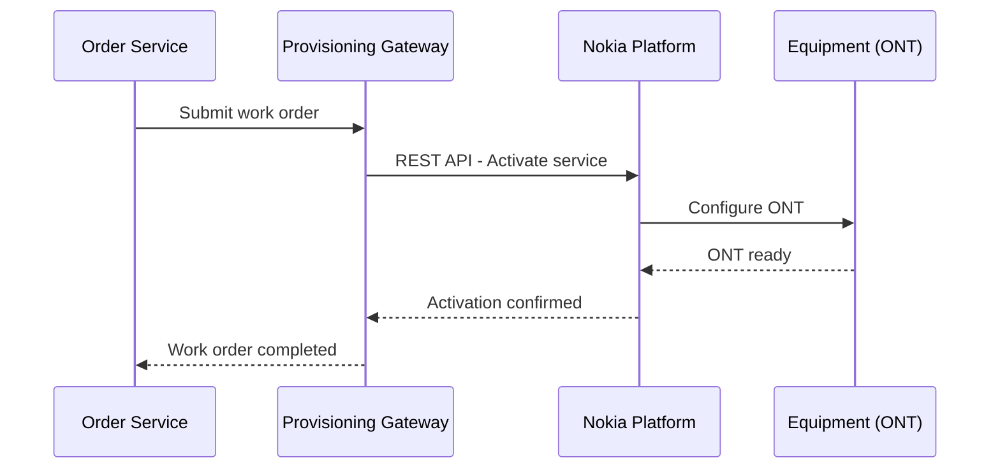
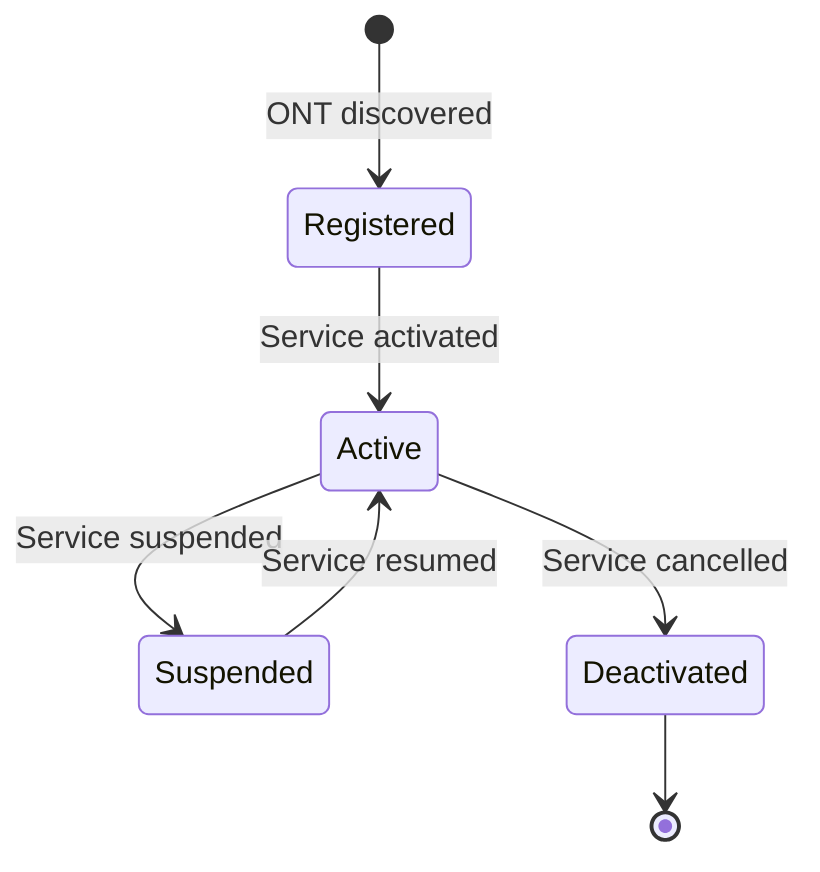

---
aliases:
  - Provisioning
  - Service Activation
  - Nokia Integration
tags:
  - embrix/customer
  - embrix/provisioning
  - embrix/nokia
type: knowledge
hub: Customer
created: 2026-05-07
sources:
  - "006 Provisioning Configuration_pptx.md"
  - "3 - Embrix User Guide - Customer Hub_pdf.md"
---

# 👤 Provisioning

> **Parent**: [[00-MOC-Embrix-Knowledge-Base]]
> **Hub**: Customer
> **Related**: [[04-ARCH-Gateway-Framework]] | [[12-CUST-Order-Management]] | [[61-OPS-Jobs-Management]]

---

## 1. Provisioning Overview

Provisioning is the process of activating, modifying, suspending, or deactivating services on the **external network platform** (e.g., Nokia).

## 2. Work Order Types

| Type | Trigger | Nokia Action |
|------|---------|-------------|
| **Activate** | NEW order | Create service on ONT |
| **Modify** | MODIFY order | Update service profile |
| **Suspend** | SUSPEND order / Collection | Disable ONT port |
| **Resume** | RESUME order / Payment | Enable ONT port |
| **Deactivate** | CANCEL order | Remove service from ONT |

## 3. ONT Lifecycle

## 4. Equipment Management

| Field | Description |
|-------|-------------|
| **Serial Number** | Unique ONT identifier |
| **Model** | ONT hardware model |
| **MAC Address** | Device MAC address |
| **Port** | OLT port assignment |
| **Status** | Registered, Active, Suspended, Deactivated |

## 5. Error Handling

| Error | Cause | Resolution |
|-------|-------|------------|
| `PROV_TIMEOUT` | Nokia API did not respond | Check Nokia connectivity, retry |
| `ONT_NOT_FOUND` | Serial number not registered | Verify ONT registration |
| `PORT_UNAVAILABLE` | OLT port already assigned | Select different port |
| `SERVICE_CONFLICT` | Service already exists on port | Check existing assignments |

> ⚠️ **Critical**: Provisioning failures do NOT block billing. The order may show COMPLETED in Embrix while Nokia activation failed. Always verify DLQ.

---

*Back to [[00-MOC-Embrix-Knowledge-Base]]*
