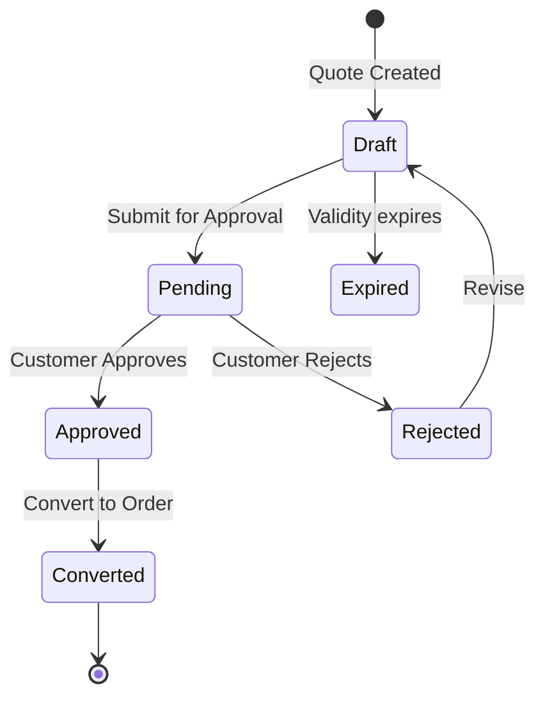

---
aliases:
  - Quote Management
  - CPQ
  - Quotation
tags:
  - embrix/customer
  - embrix/quote
  - embrix/cpq
type: knowledge
hub: Customer
created: 2026-05-07
sources:
  - "3 - Embrix User Guide - Customer Hub_pdf.md"
---

# 👤 Quote Management

> **Parent**: [[00-MOC-Embrix-Knowledge-Base]]
> **Hub**: Customer
> **Related**: [[12-CUST-Order-Management]] | [[21-PRICE-Price-Offer-Models]]

---

## 1. CPQ Flow


| Phase | Description |
|-------|-------------|
| **Configure** | Select product/service, configure attributes |
| **Price** | System calculates pricing based on pricing models |
| **Quote** | Generate formal quotation for customer approval |
| **Order** | Convert approved quote to order |

## 2. Quote Lifecycle



## 3. Quote Configuration

| Field | Description |
|-------|-------------|
| **Quote Number** | Auto-generated unique identifier |
| **Validity Period** | How long the quote is valid (default: 30 days) |
| **Items** | Products/services with configured pricing |
| **Total** | Calculated total including recurring and one-time |
| **Terms** | Contract terms included in the quote |

## 4. Quote to Order Conversion

```
Customer Center → Quotation → Select Quote →
  Review Items → CONVERT TO ORDER →
  System creates NEW order with quote items →
  Order follows standard order lifecycle
```

> ⚠️ **Rule**: A quote can only be converted to an order **once**. After conversion, the quote status is `CONVERTED` and cannot be reused.

---

*Back to [[00-MOC-Embrix-Knowledge-Base]]*
