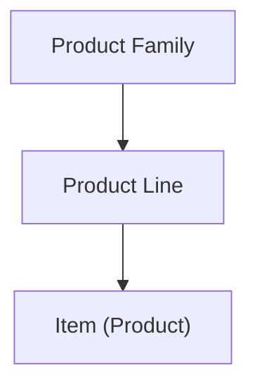

---
aliases:
  - Item Master
  - Product Catalog
  - Product Family
tags:
  - embrix/pricing
  - embrix/product
  - embrix/catalog
type: knowledge
hub: Pricing
created: 2026-05-07
sources:
  - "007 Item Master_pptx.md"
  - "4 - Embrix User Guide - Pricing Hub_pdf.md"
---

# 💰 Item Master

> **Parent**: [[00-MOC-Embrix-Knowledge-Base]]
> **Hub**: Pricing
> **Related**: [[21-PRICE-Price-Offer-Models]] | [[23-PRICE-Bundle-Package]] | [[13-CUST-Subscription-Management]]

---

## 1. Product Hierarchy



| Level | Description | Example |
|-------|-------------|---------|
| **Product Family** | Top-level grouping | Telecommunications |
| **Product Line** | Service category | Internet, TV, Voice |
| **Item** | Specific product | Internet 100Mbps, Internet 200Mbps |

## 2. Item Types

| Type | Charge Model | Example |
|------|-------------|---------|
| **Recurring** | Monthly/annual charge | Internet subscription $29.99/mo |
| **One-Time** | Single charge at activation | Installation fee $50 |
| **Usage** | Charge per unit consumed | Data overage $0.01/MB |
| **Equipment** | Device charge (OT or recurring) | ONT device $100 |

## 3. Item Configuration

| Field | Description |
|-------|-------------|
| **Item Code** | Unique product identifier |
| **Name** | Display name |
| **Description** | Detailed description |
| **Product Line** | Parent category |
| **Charge Type** | Recurring, One-Time, Usage |
| **GL Code** | General Ledger code for revenue posting |
| **Tax Category** | Tax classification code |
| **Status** | Active, Inactive |

## 4. UI Path

```
Pricing Center → Basic Config → Item Master →
  + CREATE → Fill fields → Select Product Line →
  Assign GL Code → SAVE
```

---

*Back to [[00-MOC-Embrix-Knowledge-Base]]*
