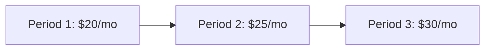

---
aliases:
  - Price Offer Models
  - Pricing Models
  - Tiered Pricing
tags:
  - embrix/pricing
  - embrix/price-model
type: knowledge
hub: Pricing
created: 2026-05-07
sources:
  - "008 Price Offer Models_pptx.md"
  - "4 - Embrix User Guide - Pricing Hub_pdf.md"
  - "BRM Pricing - video 7 (transcribed).md"
---

# 💰 Price Offer Models

> **Parent**: [[00-MOC-Embrix-Knowledge-Base]]
> **Hub**: Pricing
> **Related**: [[20-PRICE-Item-Master]] | [[22-PRICE-Discount-Offer-Models]] | [[31-BILL-Rating-Engine]]

---

## 1. Pricing Model Types

| Model | Description | Use Case |
|-------|-------------|----------|
| **Simple** | Fixed price per unit | Internet 100Mbps = $29.99/mo |
| **Tiered** | Price varies by tier bracket, each tier has its own rate | Volume tiers: 1-10 @ $5, 11-50 @ $4, 51+ @ $3 |
| **Volume** | Price based on total volume, all units at same rate | 25 units → all at $4 (tier 11-50) |
| **Staircase** | Price escalates/de-escalates over time periods | Year 1: $20, Year 2: $25, Year 3: $30 |
| **Usage-Based** | Charge per unit of consumption | $0.01 per MB of data |

## 2. Tiered vs Volume Pricing

### Tiered (Graduated):
```
Quantity: 25 units
Tier 1 (1-10):  10 × $5.00 = $50.00
Tier 2 (11-25): 15 × $4.00 = $60.00
Total: $110.00
```

### Volume:
```
Quantity: 25 units
Falls in Tier 2 (11-50): 25 × $4.00 = $100.00
Total: $100.00
```

## 3. Price Offer Configuration

| Field | Description |
|-------|-------------|
| **Offer Name** | Display name for the price offer |
| **Item** | Linked product from Item Master |
| **Pricing Model** | Simple, Tiered, Volume, Staircase, Usage |
| **Currency** | Pricing currency |
| **Effective Date** | When this price becomes active |
| **End Date** | When this price expires (optional) |
| **Tiers** | Tier definitions (from/to quantity, rate) |

## 4. Staircase Pricing



| Period | Duration | Rate | Use Case |
|--------|----------|------|----------|
| Period 1 | Months 1-12 | $20 | Introductory rate |
| Period 2 | Months 13-24 | $25 | Standard rate |
| Period 3 | Month 25+ | $30 | Premium rate |

## 5. UI Path

```
Pricing Center → Price Management → Price Offers →
  + CREATE → Select Item → Select Model Type →
  Configure Tiers/Rates → Set Effective Date → SAVE
```

---

*Back to [[00-MOC-Embrix-Knowledge-Base]]*
