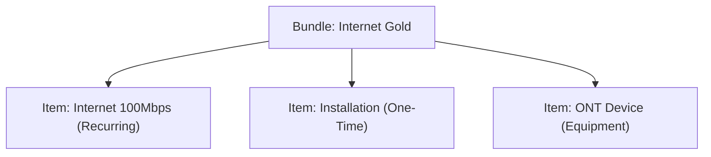
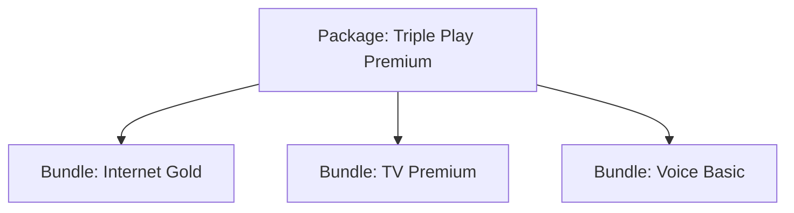

# 💰 Bundle & Package

> **Parent**: [[00-MOC-Embrix-Knowledge-Base]] | **Hub**: Pricing
> **Related**: [[20-PRICE-Item-Master]] | [[21-PRICE-Price-Offer-Models]] | [[12-CUST-Order-Management]]

---

## 1. Bundle vs Package

| Concept | Bundle | Package |
|---------|--------|---------|
| **Definition** | Single service-type grouping | Multi service-type grouping |
| **Example** | Internet bundle (100Mbps + ONT) | Triple Play (Internet + TV + Voice) |
| **Service Types** | One | Multiple |
| **Dependency** | Items depend on each other | Packages include multiple bundles |

## 2. Bundle Structure



## 3. Package Structure



## 4. Dependency Rules

| Rule | Description |
|------|-------------|
| **Mandatory** | Item must be included in the bundle |
| **Optional** | Item can be added/removed by customer |
| **Dependent** | Item requires another item to be selected |
| **Exclusive** | Item cannot exist with certain other items |

## 5. UI Path

```
Pricing Center → Bundle Management → + CREATE →
  Name, Description → Add Items → Set Dependencies →
  Configure Pricing → SAVE
```

---

*Back to [[00-MOC-Embrix-Knowledge-Base]]*
