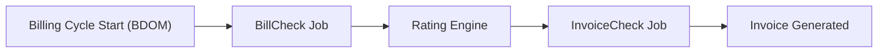
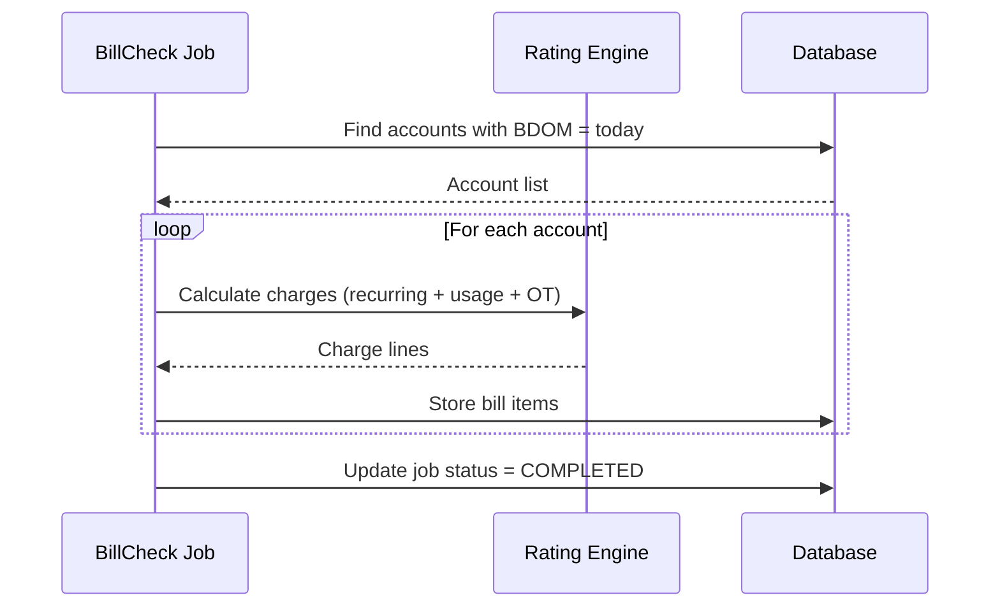

# 📄 Billing Cycle

> **Parent**: [[00-MOC-Embrix-Knowledge-Base]] | **Hub**: Billing
> **Related**: [[31-BILL-Rating-Engine]] | [[34-BILL-Invoice-Management]] | [[61-OPS-Jobs-Management]]

---

## 1. Billing Cycle Overview

## 2. BDOM (Billing Day of Month)

| Rule | Detail |
|------|--------|
| **Range** | 1–28 only (no 29, 30, 31 for consistency) |
| **Set At** | Account creation — cannot be changed later |
| **Inheritance** | Child accounts inherit BDOM from parent |
| **Cycle Period** | BDOM to BDOM-1 of next month |

**Example**: BDOM = 15 → Cycle runs from 15th of current month to 14th of next month.

## 3. Billing Jobs

| Job | Purpose | Sequence | Dependency |
|-----|---------|----------|------------|
| **BillCheck** | Calculate charges for the billing cycle | 1st | None |
| **InvoiceCheck** | Generate invoices from calculated charges | 2nd | BillCheck must complete first |

> ⚠️ **Critical**: `InvoiceCheck` MUST run AFTER `BillCheck` completes. Running them simultaneously or in reverse order causes data corruption.

## 4. BillCheck Process

## 5. Billing Cycle Configuration

| Parameter | Description | Example |
|-----------|-------------|---------|
| **Billing Frequency** | How often to bill | Monthly |
| **Advance/Arrears** | Bill before or after service period | Advance (default) |
| **Proration** | Enable proration for partial cycles | Yes |
| **Grace Period** | Days after due date before collection | 15 days |
| **Payment Term** | Invoice due date offset | NET-15 |

## 6. Cycle Types

| Type | Description |
|------|-------------|
| **Normal Cycle** | Full BDOM-to-BDOM period |
| **Short Cycle** | First cycle when activation mid-cycle |
| **Long Cycle** | When plan change creates extended period |
| **Final Cycle** | Last cycle when service is cancelled |

---

*Back to [[00-MOC-Embrix-Knowledge-Base]]*
