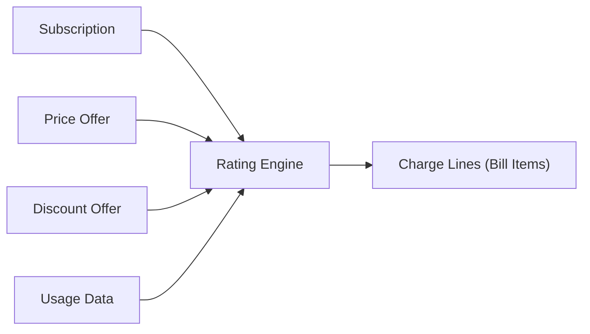

# 📄 Rating Engine

> **Parent**: [[00-MOC-Embrix-Knowledge-Base]] | **Hub**: Billing
> **Related**: [[30-BILL-Billing-Cycle]] | [[21-PRICE-Price-Offer-Models]] | [[32-BILL-Usage-Processing]]

---

## 1. Rating Process



## 2. Charge Types Calculated

| Type | Source | Example |
|------|--------|---------|
| **Recurring** | Price offer (monthly) | Internet $29.99/mo |
| **One-Time** | Price offer (activation) | Installation $50 |
| **Usage** | CDR + rating rules | Data overage $5.20 |
| **Proration** | Partial cycle calculation | 15/30 days × $29.99 = $15.00 |
| **Discount** | Discount offer | -10% = -$3.00 |
| **Tax** | Tax configuration | IVA 13% |

## 3. Proration Logic

| Scenario | Calculation |
|----------|-------------|
| **New (mid-cycle)** | (Remaining days / Total days) × Monthly rate |
| **Cancel (mid-cycle)** | (Used days / Total days) × Monthly rate |
| **Modify (mid-cycle)** | Credit old plan prorated + Charge new plan prorated |

**Example — New activation BDOM=1, activated on Jan 15:**
```
Remaining days: 17 (Jan 15–31)
Total days: 31
Proration: 17/31 × $29.99 = $16.45
```

## 4. Rating Sequence

1. **Identify subscriptions** due for billing
2. **Retrieve price offers** for each subscription item
3. **Calculate base charges** (recurring, one-time)
4. **Apply proration** if partial cycle
5. **Rate usage** from CDR data
6. **Apply discounts** from discount offers
7. **Calculate taxes** based on tax rules
8. **Generate bill items** in the database

---

*Back to [[00-MOC-Embrix-Knowledge-Base]]*
