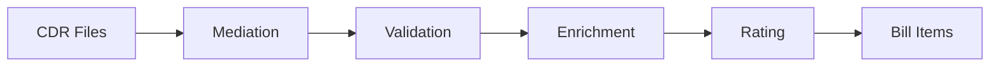

# 📄 Usage Processing

> **Parent**: [[00-MOC-Embrix-Knowledge-Base]] | **Hub**: Billing
> **Related**: [[24-PRICE-Usage-Configuration]] | [[31-BILL-Rating-Engine]] | [[30-BILL-Billing-Cycle]]

---

## 1. Usage Processing Pipeline



## 2. Processing Stages

| Stage | Action | Errors |
|-------|--------|--------|
| **Ingestion** | Upload CDR files (CSV/XML) | File format errors |
| **Parsing** | Extract fields from CDRs | Missing mandatory fields |
| **Duplicate Check** | Detect duplicate CDR records | Duplicate CDR rejected |
| **Account Matching** | Match CDR to subscriber account | Unmatched CDRs → error queue |
| **Rating** | Apply usage pricing rules | No matching price offer |
| **Aggregation** | Sum rated charges per account | — |
| **Bill Item Creation** | Create billing line items | — |

## 3. CDR Error Handling

| Error Type | Resolution |
|------------|------------|
| **Unmatched Account** | Manual review, update account mapping |
| **Duplicate CDR** | Automatically rejected, logged |
| **Missing Fields** | Reject CDR, notify operations |
| **No Price Rule** | Hold CDR, configure pricing |

## 4. Usage Report (UI)

```
Billing Center → Usage → Usage Summary →
  Filter: Account, Date Range, Service Type →
  View: Total usage, rated amount, unrated CDRs
```

---

*Back to [[00-MOC-Embrix-Knowledge-Base]]*
