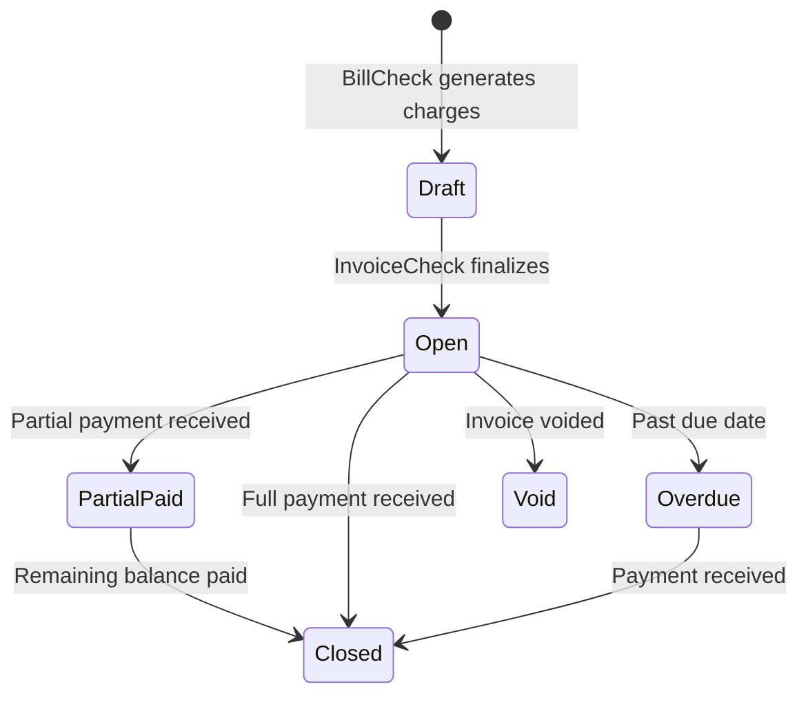

# 📄 Invoice Management

> **Parent**: [[00-MOC-Embrix-Knowledge-Base]] | **Hub**: Billing
> **Related**: [[30-BILL-Billing-Cycle]] | [[40-AR-Payment-Processing]] | [[42-AR-Credit-Note-Debit-Note]]

---

## 1. Invoice Lifecycle



## 2. Invoice Components

| Component | Description |
|-----------|-------------|
| **Header** | Account info, invoice number, dates, totals |
| **Line Items** | Individual charges (recurring, OT, usage) |
| **Tax Lines** | Tax calculations per tax category |
| **Summary** | Subtotal, tax total, grand total |
| **Payment Info** | Due date, payment methods, balance |

## 3. Invoice Number Format

```
INV-{YYYY}-{MM}-{SEQ}
Example: INV-2026-01-000145
```

## 4. Invoice Operations

| Operation | Description |
|-----------|-------------|
| **Generate** | Auto via InvoiceCheck job |
| **View** | Billing Center → Invoices → Select |
| **Download PDF** | Generate PDF from template |
| **Void** | Cancel invoice (creates reversal) |
| **Reprint** | Regenerate PDF |
| **Email** | Send to billing contact |

## 5. Invoice PDF Template

Customizable per tenant via template engine. Includes: company logo, account details, itemized charges, tax breakdown, payment instructions, terms.

---

*Back to [[00-MOC-Embrix-Knowledge-Base]]*
