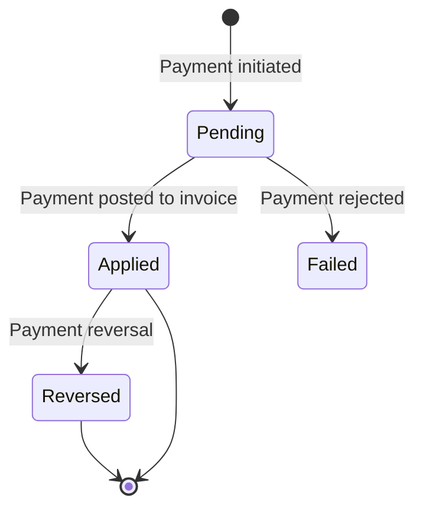

# 💳 Payment Processing

> **Parent**: [[00-MOC-Embrix-Knowledge-Base]] | **Hub**: AR
> **Related**: [[34-BILL-Invoice-Management]] | [[41-AR-Collections]] | [[43-AR-Aging-Report]]

---

## 1. Payment Methods

| Method | Type | Description |
|--------|------|-------------|
| **Cash** | Manual | In-person cash payment |
| **Check** | Manual | Physical check |
| **Bank Transfer** | Manual/Auto | Wire transfer, ACH |
| **Credit Card** | Auto | Card payment via gateway |
| **Direct Debit** | Auto | Automatic bank deduction |
| **Online Payment** | Auto | Payment portal |

## 2. Payment Lifecycle



## 3. Payment Application Rules

| Rule | Description |
|------|-------------|
| **FIFO** | Apply payment to oldest invoice first |
| **Specific Invoice** | Apply to a designated invoice |
| **Proportional** | Split across all open invoices |
| **Overpayment** | Creates credit balance on account |
| **Underpayment** | Invoice remains partially paid |

## 4. Payment Operations

```
AR Center → Payments → + NEW PAYMENT →
  Select Account → Amount → Payment Method →
  Select Invoice(s) → Apply → SAVE
```

## 5. Payment Reversal

| Reason | Effect |
|--------|--------|
| **Bounced Check** | Reverses payment, reopens invoice |
| **Chargeback** | Reverses card payment |
| **Error Correction** | Administrative reversal |

---

*Back to [[00-MOC-Embrix-Knowledge-Base]]*
