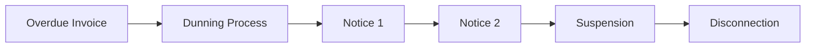

# 💳 Collections

> **Parent**: [[00-MOC-Embrix-Knowledge-Base]] | **Hub**: AR
> **Related**: [[40-AR-Payment-Processing]] | [[43-AR-Aging-Report]] | [[13-CUST-Subscription-Management]]

---

## 1. Collection Flow



## 2. Dunning Stages

| Stage | Days Overdue | Action |
|-------|-------------|--------|
| **Reminder** | 1-15 | Email/SMS reminder |
| **Warning** | 16-30 | Warning letter, phone call |
| **Suspension Notice** | 31-45 | Final notice before suspension |
| **Service Suspension** | 46+ | Service suspended automatically |
| **Disconnection** | 90+ | Service disconnected, account closed |

## 3. Collection Actions

| Action | Trigger | Reversible |
|--------|---------|-----------|
| **Send Reminder** | Automated by dunning schedule | N/A |
| **Apply Late Fee** | Configurable per policy | Yes (credit note) |
| **Suspend Service** | Automated or manual | Yes (payment + resume order) |
| **Disconnect Service** | Manual approval required | Yes (reconnection order) |
| **Write Off** | Manual approval, beyond collection | No (creates GL entry) |

## 4. Collection Job

```
CollectionCheck Job →
  Find overdue accounts →
  Determine dunning stage →
  Execute configured action →
  Update collection status
```

## 5. Reconnection Process

```
Payment received (covers all overdue) →
  Auto-create RESUME order →
  Provisioning resumes service →
  Collection status cleared
```

> ⚠️ **Rule**: Reconnection requires ALL overdue invoices paid, not just the current one.

---

*Back to [[00-MOC-Embrix-Knowledge-Base]]*
