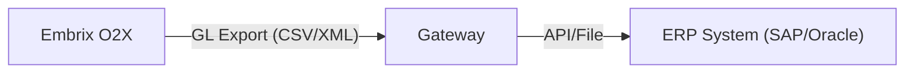

# 📊 ERP Integration

> **Parent**: [[00-MOC-Embrix-Knowledge-Base]] | **Hub**: Revenue
> **Related**: [[50-REV-GL-Posting]] | [[04-ARCH-Gateway-Framework]]

---

## 1. Integration Architecture

## 2. Export Data

| Data Type | Format | Frequency |
|-----------|--------|-----------|
| **Journal Entries** | CSV/XML | Daily batch |
| **Invoice Register** | CSV | Monthly |
| **Payment Register** | CSV | Daily batch |
| **AR Aging** | CSV | Weekly |
| **Tax Report** | CSV | Monthly |

## 3. Integration Modes

| Mode | Description |
|------|-------------|
| **File Export** | Generate CSV/XML, upload to ERP |
| **API** | REST/SOAP API integration |
| **Middleware** | Via integration platform (MuleSoft, etc.) |

---

*Back to [[00-MOC-Embrix-Knowledge-Base]]*
