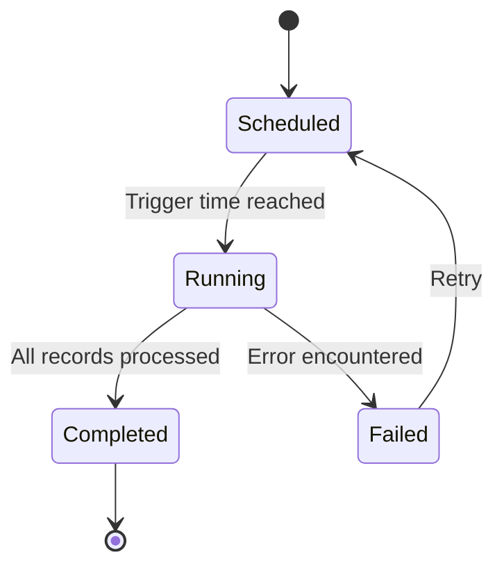

# ⚙️ Jobs Management

> **Parent**: [[00-MOC-Embrix-Knowledge-Base]] | **Hub**: Operations
> **Related**: [[30-BILL-Billing-Cycle]] | [[41-AR-Collections]] | [[62-OPS-Notification-Engine]]

---

## 1. Job Types

| Job | Module | Purpose | Schedule |
|-----|--------|---------|----------|
| **BillCheck** | Billing | Calculate charges | Daily (per BDOM) |
| **InvoiceCheck** | Billing | Generate invoices | Daily (after BillCheck) |
| **CollectionCheck** | AR | Execute dunning actions | Daily |
| **PaymentImport** | AR | Import payment files | Daily |
| **UsageImport** | Billing | Import CDR files | Daily/Hourly |
| **GLExport** | Revenue | Export GL entries | Daily |
| **ReportGeneration** | All | Generate scheduled reports | Configurable |

## 2. Job Lifecycle



## 3. Job Monitoring

```
Operations → Jobs → Job Dashboard →
  View: Running, Completed, Failed →
  Drill down: Records processed, errors, duration
```

## 4. Job Dependencies

| Job | Must Run After |
|-----|----------------|
| InvoiceCheck | BillCheck |
| GLExport | InvoiceCheck |
| CollectionCheck | InvoiceCheck |

> ⚠️ **Critical**: Violating job dependencies causes data inconsistency.

---

*Back to [[00-MOC-Embrix-Knowledge-Base]]*
