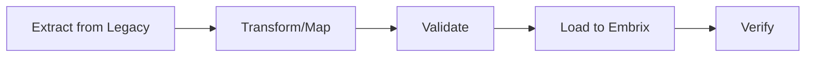

# ⚙️ Data Migration

> **Parent**: [[00-MOC-Embrix-Knowledge-Base]] | **Hub**: Operations
> **Related**: [[10-CUST-Account-Management]] | [[03-ARCH-Data-Model]]

---

## 1. Migration Scope

| Data Type | Source | Notes |
|-----------|--------|-------|
| **Accounts** | Legacy BSS | With hierarchy preserved |
| **Contacts** | Legacy CRM | Address validation |
| **Subscriptions** | Legacy billing | Active subscriptions only |
| **Invoices** | Legacy billing | Open invoices + history |
| **Payments** | Legacy AR | Applied payments |
| **Products** | Legacy catalog | Price offers + items |

## 2. Migration Process

## 3. Validation Rules

- Account IDs unique
- BDOM in range 1-28
- Currency codes valid (ISO 4217)
- Required fields populated
- Cross-references resolved

## 4. Rollback Strategy

| Phase | Rollback |
|-------|----------|
| **Pre-load** | Cancel import |
| **Post-load (pre-cutover)** | Delete imported data |
| **Post-cutover** | Point of no return — use fix scripts |

---

*Back to [[00-MOC-Embrix-Knowledge-Base]]*
